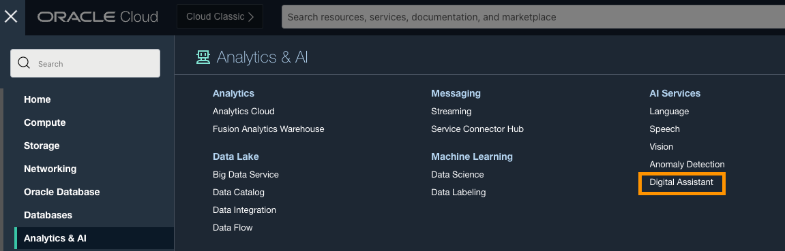
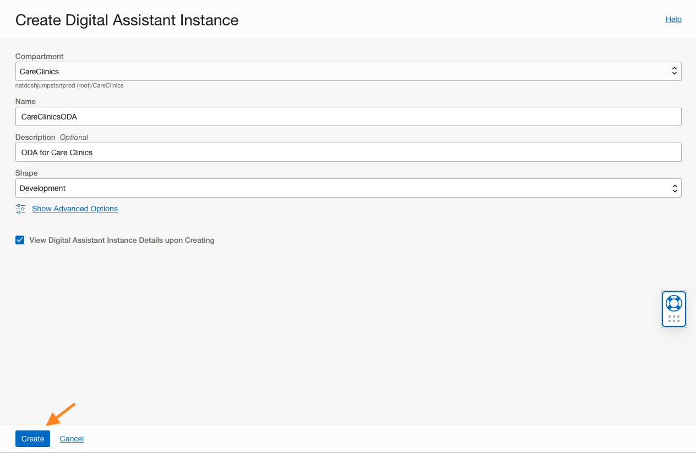
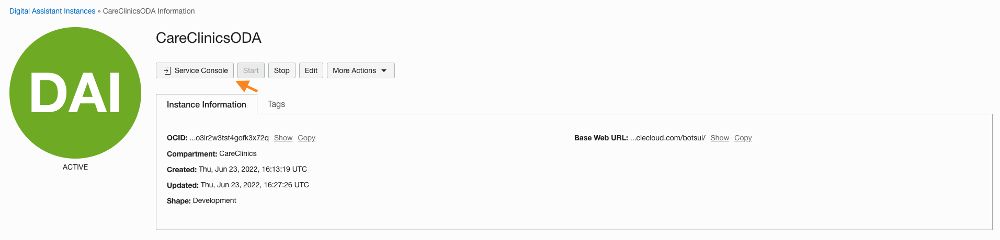
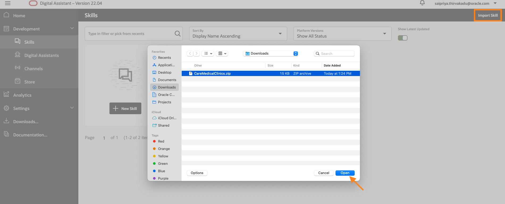
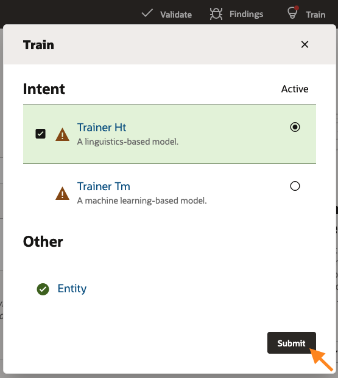
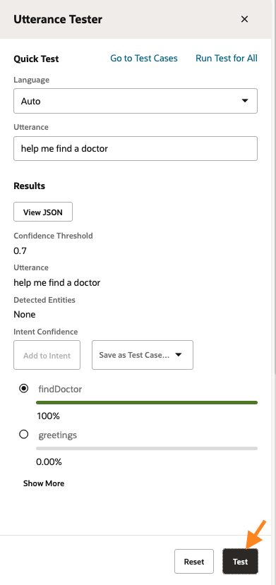

# Build a Digital Assistant
## Introduction

In this lab, we will build a Digital Assistant for patients to schedule an appointment online with the Doctor.

Estimated Time: 2 hours
### Objectives

In this lab, you will:

- Create a skill, define intents, utterances, entities.
- Design a conversation flow.
- Create a custom component to update the database from the chatbot.
- Validate, debug and test your skill.

Pre-requisites 


Before we get started:

- Install NodeJS in your local machine.

- Download the Skill template - [download](files/CareMedicalClinics.zip)

## Task 1: Create a Digital Assistant Instance and Import the Skill
1. Log in to the Oracle Cloud at cloud.oracle.com. Cloud Account Name is howarduniversity. Click “Next”.
2. Click on “Direct Sign-In” and enter your Cloud Account email and password.
3. Once you are logged in, you are taken to the cloud services dashboard where you can see all the services available to you. Click the navigation menu in the upper left to show top level navigation choices.
4. Click **Digital Assistant**

  

5. Select the CareClinics compartment and create a Digital Assistant instance. 

  

6. After the instance is successfully created. Click on the Service Console to open the ODA console. 

  

7. Now, select the navigation on the top left menu, select Skills under Development and import the Skill which you downloaded.

  

## Task 2: Create and test an intent
Oracle Digital Assistant's underlying natural language processing (NLP) engine doesn't inherently know about the business or task that a skill is supposed to assist with. For the skill to understand what it should react to, you need to define intents and examples (utterances) for how a user would request a specific intent.

You will create intents for finding a doctor and positive health therapy tips. 

Create the Find a Doctor intent: 

1. Click the + Intent button.
2. Next to the Conversation Name field, click the Edit button, and enter Find Doctor.
3. In the Name field, type findDoctor.
4. Select and copy all of the example sentences below to your clipboard and paste in the Advance Input Mode section under Examples

    ```
    <copy>
    find a doc
    help from doctor
    how can I find the doctor?
    looking for a doctor
    need doctor assistance
    Where is the doc?
    </copy>
    ```

    (You'll notice that it's fine for utterances to have inconsistent punctuation and capitalization.)
5. Click the +Create button.

  

### Create the Positive Health intent:

1. Click the + Intent button.
2. Next to the Conversation Name field, click the Edit button, and enter Positive Health.
3. In the Name field, type positiveHealth.
4. Select and copy all of the example sentences below to your clipboard and paste in the Advance Input Mode section under Examples

    ```
    <copy>
    health tips
    mental health treatment
    need positive health tips
    positive outlook
    mental health therapy
    </copy>
    ```
5. Click the +Create button.

### Train and test the intents:

You've now provided the basic ingredients that allow the skill to recognize user input for both the intents. Currently, the skill can't understand any user input.

To enable the skill to interpret user input based on the utterances that you just added, you need to train to build the intent model.

1. On the right side of the page, locate and click the Train. Select Trainer Ht and then click Submit.

  

2. Let's perform a quick test in the utterance tester.

  

  Go ahead and test your own utterances and train your bot.


