# Build a Healthcare Portal using Oracle Content Management
## Introduction

What is Oracle Content Management?

Oracle Content Management is a cloud-based content hub to drive omni-channel content management and accelerate experience delivery. It offers powerful collaboration, workflow management, and development capabilities to streamline the creation and delivery of content and improve customer and employee engagement.

In this lab, you will build a website for Care Clinics and integrate a chatbot to help the patients to schedule an appointment online.

Estimated Time: 2 hours

### Objectives

In this lab, you will learn how to:

- Create a website from a Blank Template.
- Build assets and publish them on the website using the Asset Management capability within OCM. 
- Sync the documents in your local machine. 
- Use recommendations and audience attributes feature to show only relavent data to the patients. 
- Integrate Chatbot onto the web page.

## Pre-requisites

1. Download the folder: 
2. Install your favorite IDE (Preferred - Visual Studio Code)
3. Go to the Documents folder under Collaboration and upload the *Lab Reports* Folder. The folder contains a few sample documents. (Add screenshot)
4. Follow the below steps to download the Oracle Content in your local machine:
- Click the *Avatar* icon on th top right of the page and select *Download Apps*.
- Copy the *Service Url* from the page.
  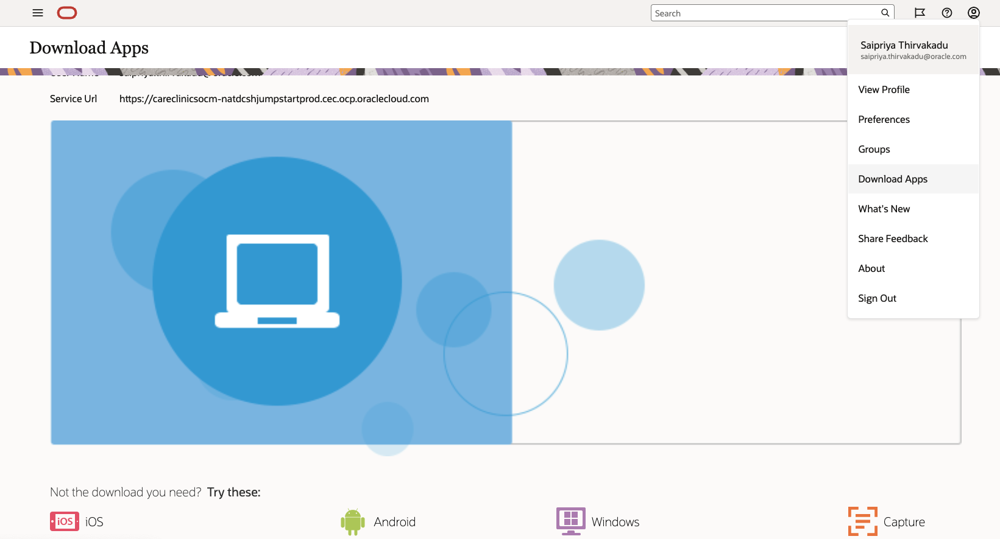
- After download, click on *Add account* button and paste your *Service Url*.
  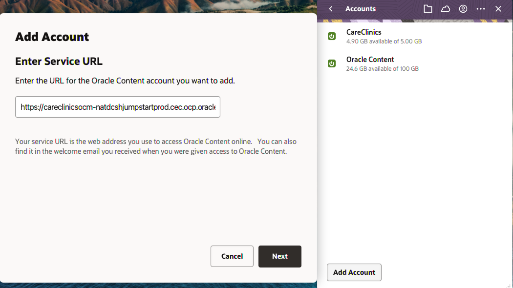
- Once you click *Next*, it will prompt you to enter your credentials. 
- Add the *Account name* and click the *Next* button.
  
- Sync the site documents you would like. 
  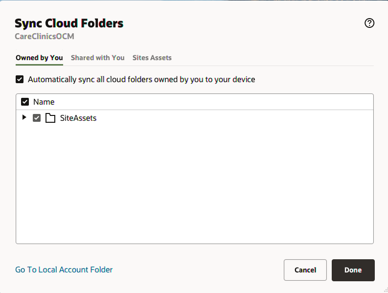
- Sync the site theme. 
  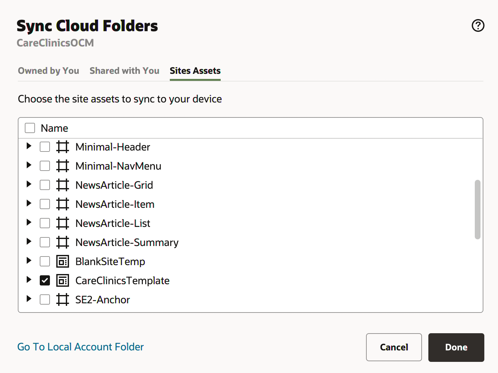
- Go ahead and check your local folder.
  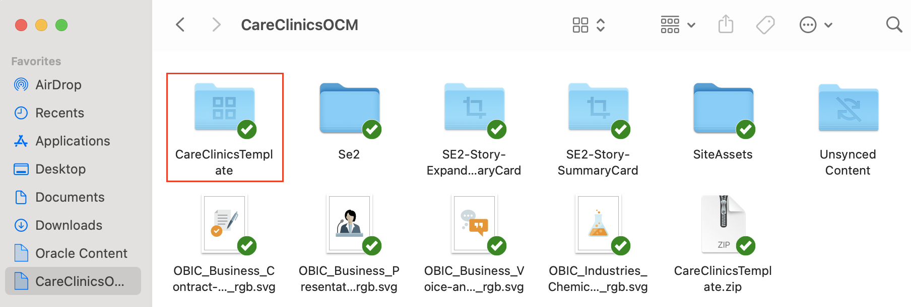


## Task 1: Create a Oracle Content Management Instance and Import the template

1. Log in to the Oracle Cloud at cloud.oracle.com. Cloud Account Name is howarduniversity. Click “Next”.
2. Click on “Direct Sign-In” and enter your Cloud Account email and password.
3. Once you are logged in, you are taken to the cloud services dashboard where you can see all the services available to you. Click the navigation menu in the upper left to show top level navigation choices.
4. Click **Instances** under **Content Management**
  
5. Select the CareClinics compartment and create an instance.
  
6. After the instance is successfully created. Click on the *Open Instance* to open the OCM console. 
  
7. Click on Sites on the left navigation pane, click on *Configure* and *Save* button on the next screen. 
  
8. Click on the View all templates in the Developer tab. 
  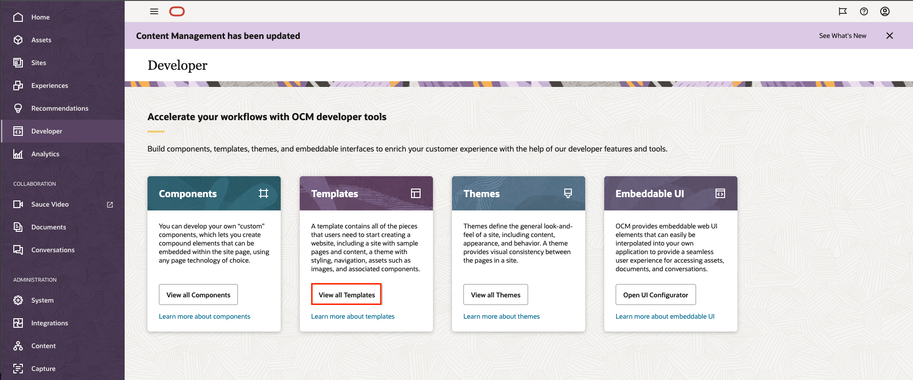
9. Go ahead and import the template package which you dowloaded. 
  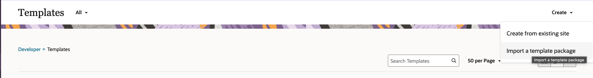

10. Upload the file into documents and hit the *OK* button to import a template.
  

## Task 2: Create a Site from the template

1. Go ahead and click on the icon to create a site from the template which you just imported.
  

2. Now, select Create a new repository from the drop-down under the Asset Repository sections. 
  

3. In properties section, enter the following details and hit the *Save* button: 
  - Name: CareClinics
  - Asset Types: Bio, File, Image, NewsArticle, SE2-Story, Videos
  - Taxonomy - PatientInfo(PAT)
    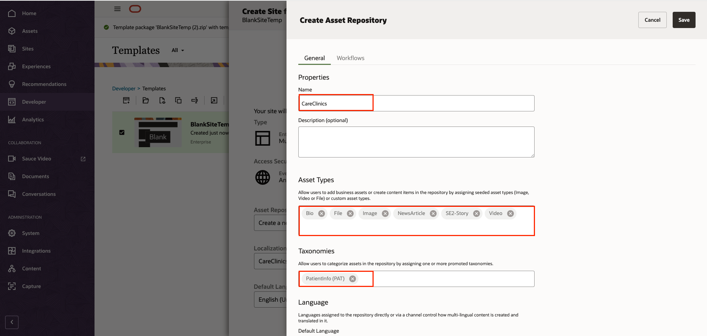

4. Under the configure site section, enter the following details: 
  - Name: CareClinics
  - Assets in Target Repository - Leave it as is (Default - Duplicate Assets)
    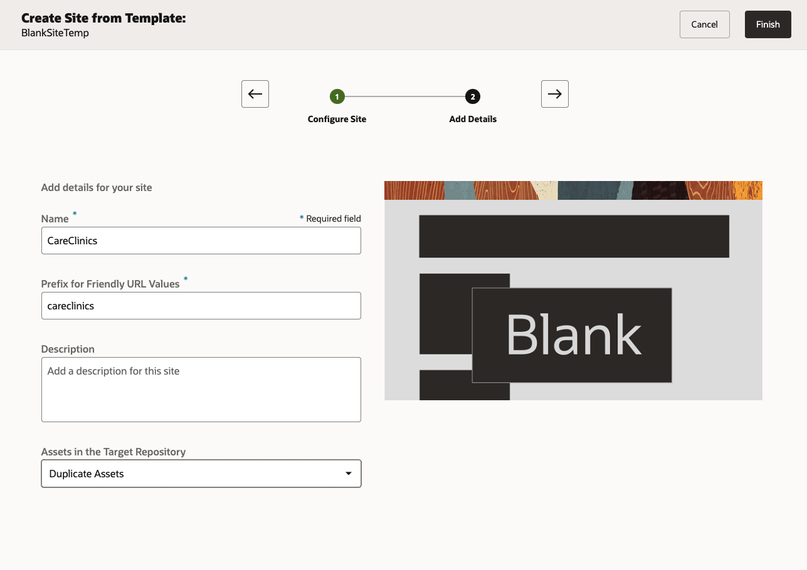
  - Now hit the *Finish* button.
  
## Task 3: Prepare a Repository

Create a Asset type: 

1. Select *Content* under the *Administration section* in the left navigation pane.  
2. Pick Asset types from the drop down and click on the *Create* button on the top right of the page to create your own Asset type.
3. Now, enter the following details:
  - Name: Specialization
  - Choose Asset Type: Create a Content Item type
  - Click the *Create* button
    
  - Drag and drop the *Text* field under the Content type definition and update the *Text settings* as follows:
  - Provide the display name - *Specialization name* and click the *Next* button.
  
  - *Save* the Asset Type.

Create Taxonomies:

1. Select *Taxonomies* from the drop-down.
  
2. Create a taxonomy to display the information regarding CareClinics.
  - Name: CareClinicsInfo
  - Abbreviation: CCI
  
  - Add Category - Blogs
  - Add Sibling - Health Talks
  - Add Sibling - Testimonials
  - Add Sibling - Specializations
  - Select the following checkbox to allow publishing the taxonomy and click the *Done* button.
    

3. Select the Taxonomy (CareClinicsInfo) which you just created and click the *Promote* button.
  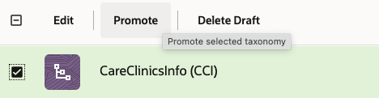 

4. Confirm to proceed Promotion. 
   

5. Publish the Taxonomy.
   

Add the Taxonomy and Content types to the Repository:

1. Edit the repository by adding the Specialization content type and CareClinicsInfo taxonomy to the CareClinics Repository.
   
2. Click the *Save* button.

## Task 4: Add Assets to the repository

Oracle Content Management's structure starts with repositories. A repository is a storage location for assets that you need for building web, mobile, or other user experiences in your organization. An asset can be a content item that represents an individual piece of content, such as a blog post, case study, or product information; or a digital asset that represents an image, video, or other type of media that you need in your experiences.


We will now see the process to create the assets in a repository: 

1. Go to the left navigation pane and select *Assets*. You will observe that there are CareClinics repository which already contains a few assets. 
 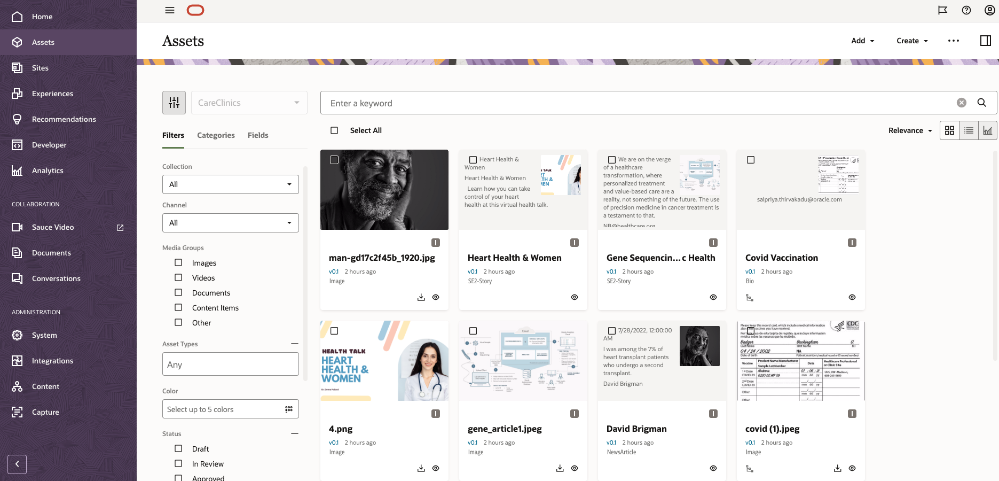
2. We will select *Create* button and select Create Content Item from the dropdown. 
 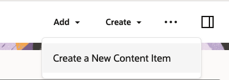
3. Now, we will start creating content items as follows: 

*Specialization:* 

1. Select Specialization from the dropdown. 
 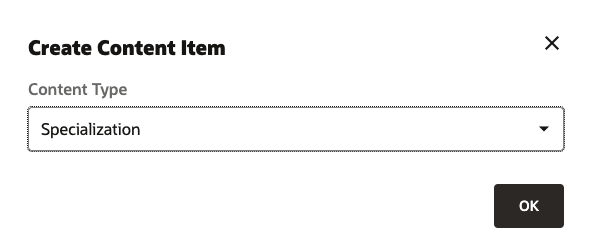
2. Content Item Properties: 
  - Name: Emergency Care
  - Specialization name: Emergency Care
  - Click the *Save* and *Done* button.
 
3. Repeat step 1 and 2 for the following specializations: 
  - Name: Cardiology, Specialization name: Cardiology
  - Name: Neurology, Specialization name: Neurology
  - Name: Radiology, Specialization name: Radiology
  - Name: Rehabilitation, Specialization name: Rehabilitation
  - Name: Surgery, Specialization name: Surgery
  - Name: Stroke Care, Specialization name: Stroke Care
  - Name: Spiritual Care, Specialization name: Spiritual Care
4. Select category - (CareClinicsInfo > Specializations)
 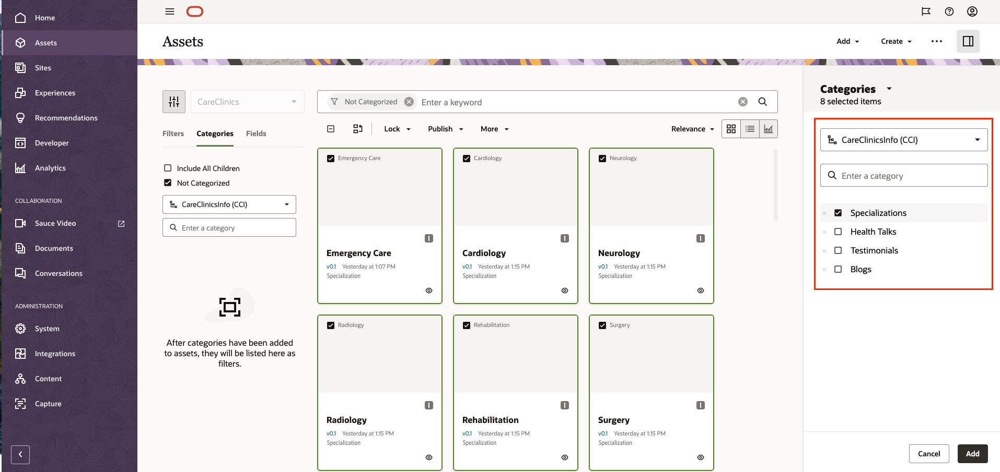

*Personal Information:*

*Note: * Use the images from the PatientInfo folder which you downloaded. 

1. Select Bio from the dropdown. 
2. Content Item Properties:
- Name: Health Insurance
- Image: InsuranceCard.jpeg
- Select category (PatientInfo(PAT)>InsuranceCard)
  
- Email: Enter your email- Ex: saipriya.thirvakadu@oracle.com
3. Repeat step 1 and 2 to create another Content Item: 
- Name: Covid Vaccination Proof
- Image: covidvaccination.jpeg 
- Select category - (PatientInfo(PAT)- VaccinationProof)
- Email: Enter your email- Ex: saipriya.thirvakadu@oracle.com
4. Ensure the Vaccination Proof and Insurance Card is added to the right category.
  

*News Article:*

*Note: * Use the images from the Testimonials folder which you downloaded. 

1. Select NewsArticle from the dropdown. 
2. Content Item Properties: 
  - Name: Justin Lester
  - Description (Optional): Patient with COVID-19, pneumonia and heart failure survives with the help of ECMO.
  - Author: Justin Lester
  - Date: 07/09/2022
  - Content: Patient with COVID-19, pneumonia and heart failure survives with the help of ECMO.
  - Image: JustinLester.jpg
  - Category: CareClinicsInfo > Testimonials
    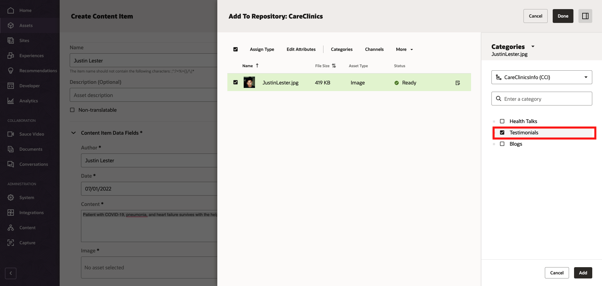 
  - Click the *Save* and *Done* button.
3. Repeat step 1 and 2 to create another Content Item: 
  - Name: Kathy Maden
  - Description (Optional): Kathy came to Clinics Hospital for a total right hip replacement using an anterior approach. The next day, she was able to return home. Within three days of her surge...
  - Author: Kathy Maden
  - Date: 03/01/2022
  - Content: Kathy came to Clinics Hospital for a total right hip replacement using an anterior approach. The next day, she was able to return home. Within three days of her surge...
  - Image: KathyMaden.jpg
  - Category: CareClinicsInfo > Testimonials
  - Click the *Save* and *Done* button.
4. Ensure the NewsArticle Assets are added to the right category.
  


*Health Talks*

*Note: * Use the images from the HealthTalks folder which you downloaded. 

1. Select SE2-Story from the dropdown. 
2. Content Item Properties: 
  - Name: Mental Health and Motherhood
  - Summary:  The isolation, loss and fear we’ve experienced during the COVID-19 pandemic has taken its toll on everyone’s mental health. Just ask any mom who’s experienced the weight of the pandemic on top of the everyday stresses of parenthood.
  - Media: motherhood.png | Category (CareClinicsInfo > HealthTalks)
  - Title: Mental Health and Motherhood
  - Content Description: The isolation, loss and fear we’ve experienced during the COVID-19 pandemic has taken its toll on everyone’s mental health. Just ask any mom who’s experienced the weight of the pandemic on top of the everyday stresses of parenthood.
  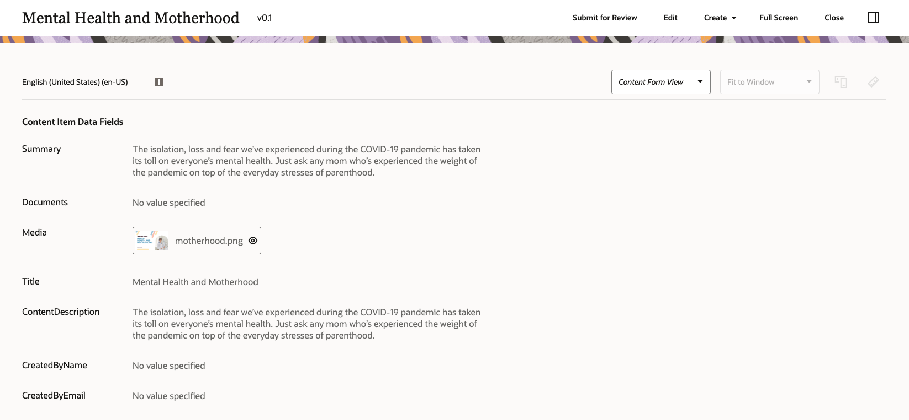
  - Asset Category: CareClinicsInfo > HealthTalks
3. Repeat step 1 and 2 to create another Content Item: 
  - Name: Focusing on Preventive Care During a Pandemic
  - Summary:  Keeping up to date on preventative screenings and wellness visits is the most important thing you can do to stay healthy.
  - Media: preventive.png | Category (CareClinicsInfo > HealthTalks)
  - Title: Focusing on Preventive Care During a Pandemic
  - Content Description: A health care facility is one of the safest places you can go to right now because everyone who's working there is taking safety so seriously.
  - Asset Category: CareClinicsInfo > HealthTalks
4. Ensure the Health Talks Assets are added to the right category.
  

*Blogs*

*Note:* Use the images from the HealthTalks folder which you downloaded. 

1. Select SE2-Story from the dropdown. 
2. Content Item Properties: 
  - Name: Decentralized clinical trials - avoiding the snapback
  - Summary:  Winston Churchill was quoted as saying, “Never let a good crisis go to waste”. The on-going pandemic is a global crisis that has forced most physical activities to be made remotely, including clinical trial activities. What we must avoid is the snapback to the pre-pandemic practice of requiring the study participant to physically visit the investigator site location.
  - Media: clinicaltrial.jpg | Category (CareClinicsInfo > Blogs)
  - Title: Decentralized clinical trials - avoiding the snapback
  - Content Description: (Copy the content from here - https://blogs.oracle.com/health-sciences/post/decentralized-clinical-trials-avoiding-the-snapback)
  - CreatedByName: Elvin Thalund
  - CreatedByEmail: et@careclinics.org
  - Asset Category: CareClinicsInfo > Blogs
  
3. Repeat step 1 and 2 to create another Content Item: 
  - Name: The Larger Pandemic - Disparities in Healthcare
  - Summary:  Earlier this year I asked the Oracle Health team if they or someone they love have had a healthcare experience that connects them to our mission. Unsurprisingly, everyone has. Also unsurprising is that many of those experiences could have been improved if those involved had access to better data, tools, and resources. These stories galvanize my desire to explore how the intersection of science, technology, and the HUMAN can improve health equity and create a better healthcare experience for all.
  - Media: pandemic.jpg | Category (CareClinicsInfo > Blogs)
  - Title: The Larger Pandemic: Disparities in Healthcare
  - Content Description: (Copy the content from here - https://blogs.oracle.com/healthcare/post/the-larger-pandemic)
  - CreatedByName: Stephanie Trunzo
  - CreatedByEmail: st@careclinics.org
  - Asset Category: CareClinicsInfo > Blogs
4. Ensure the Blogs Assets are added to the right category.
  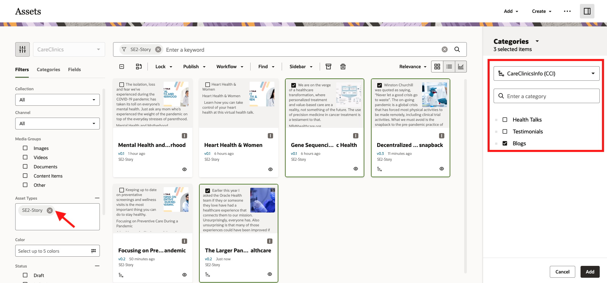

Add all assets to the channel: 

1. Select all assets and select the target channel as CareClinics in the properties bar on the right.
  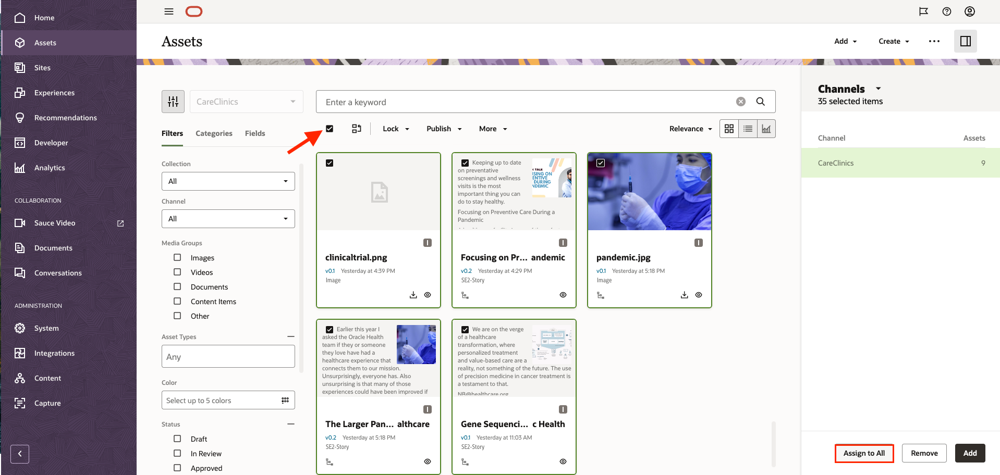

## Task 5: Create Home Page for the Care Clinics Website

In this task, you'll see how easy it is to build your healthcare portal using Site Builder. 

Firstly, we will go ahead and import the component and start working on creating the HomePage.

Import the component:

1. Click *Developer* in the left side bar and select *View all components*. 
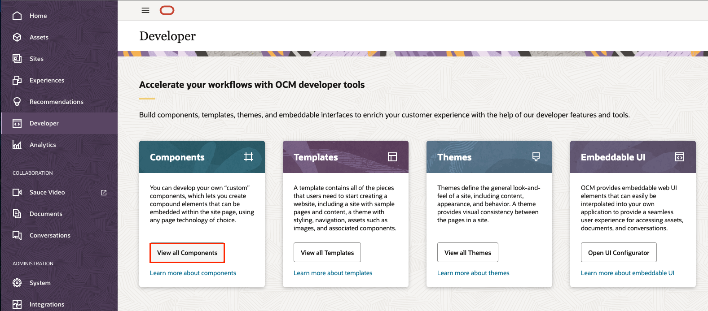
2. On the Components page, click Create, and choose *Import Component*. Upload the *Minimal-NavMenu.zip* file.

3. Now, you need to publish the Minimal-NavMenu component you imported. On the Components page, select the Minimal-NavMenu component and click Publish from the menu bar or right-click menu.

4. Repeat step 1,2,3 and import another component *SE2-Anchor* and publish the component.

Build the Home Page:

*Note:* Upload the images from HomePage folder to the Documents.

1. Open the newly created website in Site Builder by selecting it and choosing Open from the menu bar or right-click menu. 
2. In Site Builder, set the switch Edit icon to Edit mode. Enter a name (Ex: HomePage) for the update and click OK.

3. Let's use out-of-the-box components to fill in the Header slot
  - In the left sidebar, click Components icon and then click Seeded to show the list of out-of-the-box components available with Oracle Content Management.
  - In the left sidebar, look for an out-of-the-box component called Component Group. Drag and drop it into the Header slot.
  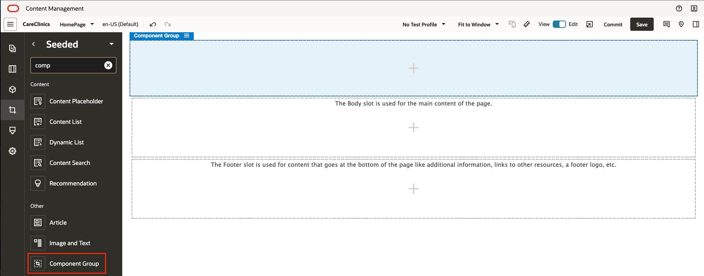
  - Click the component group's menu icon Component group's menu icon and then click Settings. Update the settings as follows: 

  | Property      | Value |
  | ----------- | ----------- |
  | Color      | #333333 |

    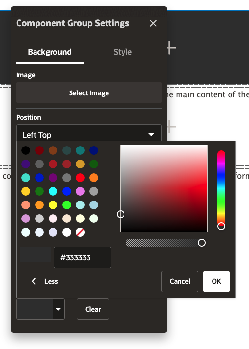
  - Drag and drop Image from the seeded components into the Header slot.

  | Property      | Value |
  | ----------- | ----------- |
  | Image      | CareClinicsLogo.png |
  | Alignment   | left |
  | Set Width | 200 |

  - Now, let’s add a navigation menu to the home page using the Minimal-NavMenu custom component. Drag and drop a Minimal-NavMenu component into the component group, to the right side of the Image component. 
  
  | Property      | Value |
  | ----------- | ----------- |
  | Alignment	| Right |
  | Top | 1.2vw |
  | Bottom | 0 |
  | Left | 0 | 
  | Right |	6vw |

  

- Save the component group with the name *Minimal-Header* so that you can reuse this component on multiple pages.
  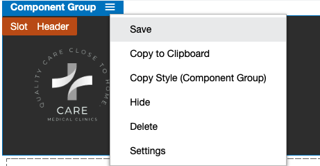
  
  
- Save the update. 

4. Let's use out-of-the-box components to fill in the Footer slot
  - In the left sidebar, click Components icon and then click Seeded to show the list of out-of-the-box components available with Oracle Content Management.
  - In the left sidebar, look for an out-of-the-box component called Component Group. Drag and drop it into the Footer slot.
  - Click the component group's menu icon Component group's menu icon and then click Settings. Update the settings as follows: 

  | Property      | Value |
  | ----------- | ----------- |
  | Color      | #333333 |

    
  - Drag and drop Image from the seeded components into the Component Group.

  | Property      | Value |
  | ----------- | ----------- |
  | Image      | Powered_by_OCE.png |
  | Alignment   | left |
  | Set Width | 300 |

  - Now, let’s add a navigation menu to the home page using the Minimal-NavMenu custom component. Drag and drop a Minimal-NavMenu component into the component group, to the right side of the Image component. 
  
  | Property      | Value |
  | ----------- | ----------- |
  | Top | 0.9vw |
  | Bottom | 0.9vw |
  | Left | 6vw | 
  | Right |	0 |
- From the left sidebar, drag and drop a Social Bar component into the component group, to the right side of the Image component.
- Complete the settings for the Social Bar component in the General tab.
  | Property      | Value |
  | ----------- | ----------- |
  | Top | 1.8vw |
  | Bottom | 1.8vw |
  | Left | 0.3vw | 
  | Right |	6vw |

- In the General tab, click Icons and then click an icon name to complete the settings.

  | Property	| Value |
  | ----------- | ----------- | 
  | URL	| - https://www.facebook.com/Oracle/ (for Facebook)
  |     | - https://www.linkedin.com/company/oracle/ (for LinkedIn)
  |      | - https://twitter.com/Oracle (for Twitter)
  |       |- https://www.youtube.com/oracle/ (for YouTube)|
  | Target | 	Open in New Window | 

  

- Save the component group with the name *Minimal-Footer* so that you can reuse this component on multiple pages.
  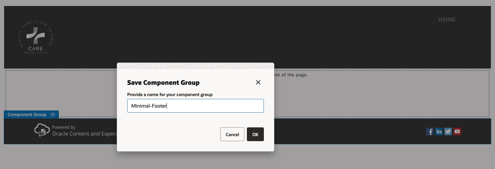
  
- Save the update. 


5. Let's move on to the Body slot:

Create a banner: 

- From the left sidebar, drag and drop a Component Group into the Body slot. We’ll create a banner using this component group and the components (which we’ll be adding into it).
- From the section layout, drag and drop *Two Columns* within the Component Group.

 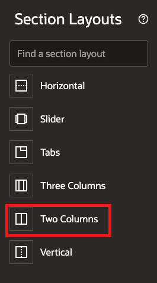

General Settings:

  | Property      | Value |
  | ----------- | ----------- |
  | First Column Width (%)	| 40 |
  | Second Column Width (%) | 55 |
  | Responsive Breakpoint (pixels) | 1023 |
  | Responsive Behavior | Hide the first column | 

  

Background Settings: 

  | Property      | Value |
  | ----------- | ----------- |
  | Image | banner.png |
  | Position | Center center |
  | Scale | Stretch | 

- Drag and drop the *Title* component in the second coloumn and click in the Title component and enter "Healing with good health and good life...". 
General Settings:

  | Property      | Value |
  | ----------- | ----------- |
  | Top | 3vw |
  | Bottom | 1.8vw |
  | Left | 7vw | 
  | Right |	6vw |

- Drag and drop the *Paragraph* component below *Title* and click in the Paragraph component and enter the following text: 

  "We aim to provide the best of care for all of our patients.

  Care Clinics is committed to providing excellent care that is convenient and accessible. Our focus on patient safety and quality is grounded in evidence-based medicine and is delivering better outcomes for our patients every day."

General Settings:
  | Property      | Value |
  | ----------- | ----------- |
  | Top | 20px |
  | Bottom | 50px |
  | Left | 7vw | 
  | Right |	6vw |

  

- *Save* the update.

Edit your theme:

1. Open the *CareClinicsTemplate* which you synced in your local system in your favorite IDE.
2. Go to the *designs/default* folder and open *design.css*. 
3. Add the following code inside *design.css*: 
    ```
    <copy>
    /* Button Style 4: CP Default (no background color)) */
    .scs-button-style-4 .scs-button-button {
        cursor: pointer;
        font-size: 1rem;
        font-weight: 400;
        border-width: 0.138vw;
        color: #ffffff;
        border-radius: 1.4375rem;
        border: 0.5px solid transparent;
    }
    .scs-button-style-4 .scs-button-button:hover,
    .scs-button-style-4 .scs-button-button:focus {
        background-color: #ab2a1c;
        border: 0.5px solid #ffffff;
    }
    .scs-button-style-4 .scs-button-button:focus {
        /* outline: 1px auto var(--SE2-outline); */
    }
    </copy>
    ```
  
4. Add the following code indode *design.json* under "scs-button":
    ```
    <copy>
				        ,{ 
                    "name": "CP_Default",
                    "class": "scs-button-style-4"
                },
                { 
                    "name": "CP_Mobile_Default",
                    "class": "scs-button-style-5"
                },
                { 
                    "name": "CP_Mobile_AltaSmall",
                    "class": "scs-button-style-6"
                }
    </copy>
    ```
  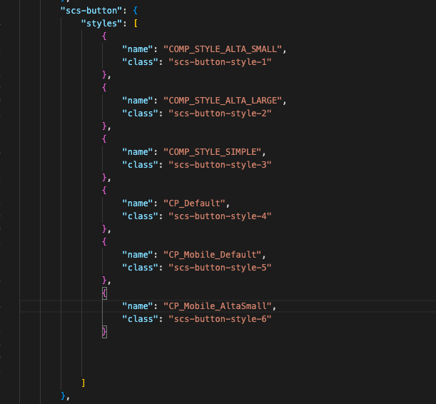

Add the images and buttons to navigate within the page:

1. From the left sidebar, drag and drop a *Component Group* below the banner and add a *Title*. Click on the title and type "You may be looking for..." and align the text to *Center*. 
  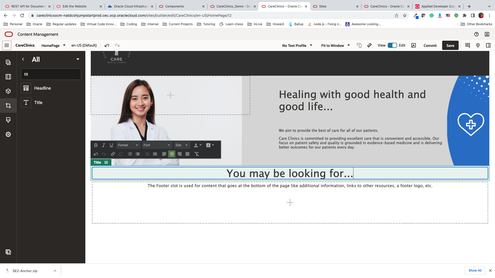

2. From the left sidebar, drag and drop a *Three Columns* under *Section Layouts* below the banner. Adjust the General> Custom settings as follows: 

  | Property      | Value |
  | ----------- | ----------- |
  | First Column Width (%)	| 10 |
  | Second Column Width (%) | 80 |
  | Third Column Width (%) | 10 |

3. Now, add 4 images to the second coloumn.

- Upload the first image and update the settings as follows:

  | Property      | Value |
  | ----------- | ----------- |
  | Image | OBIC_Industries_Chemicals_detailed_rgb.svg |
  | Alignment	| Center |
  | Set Width | 10.6875rem |
  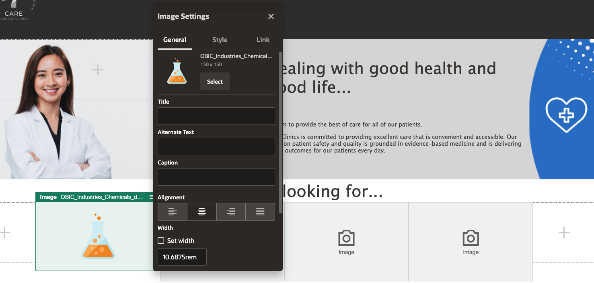
- Copy the style
  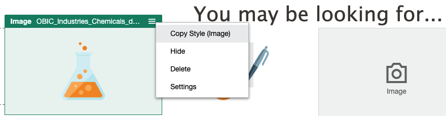
- Upload the 2nd image: OBIC_Business_Contract-Approval_detailed_rgb.svg and paste the effects. 
  
- Repeat the above steps for the following images: 
  - OBIC_Business_Presentation_F-detailed_rgb.svg 
  - OBIC_Industries_Chemicals_detailed_rgb.svg
- Save the update. 
- Add a *Spacer* component below the images. 

4. Display Content List for *Specialization*:

- Create a content layout for Specialization.
  - Open the side bar to go to the Developer tab and click on *View all Components* button. 
  - Now click on *Create* dropdown button to *Create a content layout*.
  
- Now, go to the Content under the Administration in the side bar, select the *Asset types* from the drop down, Select Specialization and navigate to Content Layout tab and pick Specialization-overview from the dropdown.
  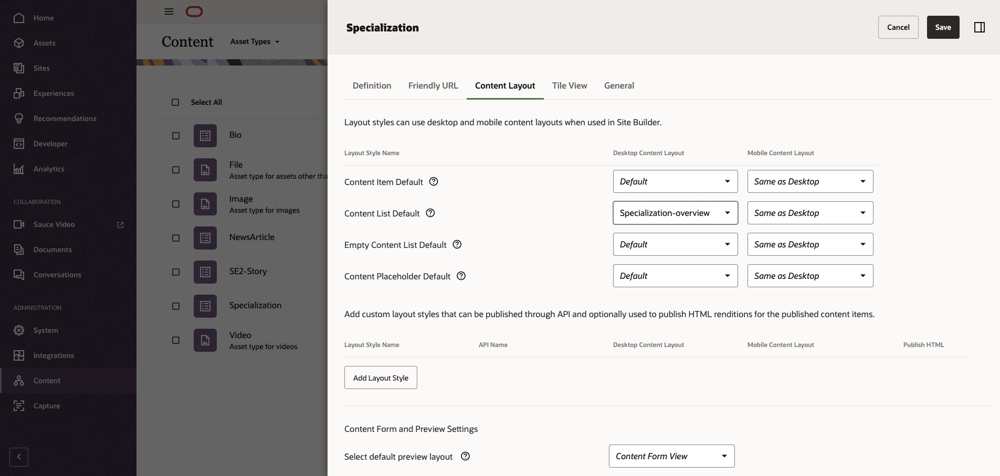
- Go back to the site to add another component group for displaying the Specializations and add the background *color* #cad9dd.
  
- We will now add the anchor tag for navigating within the page:
  - Drag and drop *SE2-Anchor* from Custom Components into the Component group.
  - Now go to the *Custom settings* and update the Anchor name as *Specializations*.
- Add a *Title*. Click on the title and type "Specializations" and align the text to *Center*. 
- Drag and drop the *Content List* from the left navigation bar into the component group below the Title and update the settings as follows:

  | Property      | Value |
  | ----------- | ----------- |
  | Content Type | Specialization |
  | Categories	| CCI>Specializations |
  | List View | Three Columns |
  
  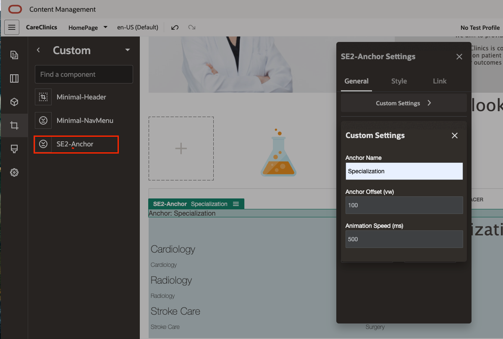
- Sync the generated content layout to the local machine. 
  
- Now open the content layout in VS Code or your favorite IDE and update the layout.html page.

*layout.html*

```
    <copy>
  {{#fields}}
  <ul class="Specialization">
  <!-- <li><h2>specialization_name</h2></li> -->
  <!-- <li><p>{{specialization_name}}</p></li> -->

  {{#scsData.detailPageLink}}
  <li><a href="{{scsData.detailPageLink}}" title="Go to detail page"><span class="detail- page">{{specialization_name}}</span></a></li>
  {{/scsData.detailPageLink}}
  </ul>
  {{/fields}}
    </copy>
    ```
  
*Design.css*

```
    <copy>
    .Specialization li {
          list-style: none;
          font-size: 30px;
          font-style: normal;
          font-variant-caps: normal;
          color: #333;
          font-weight: 200;
          margin: 0em 0em 1em 0em;
          text-align: center;
    }
    </copy>  
```

- You will observe the following changes in the Home Page.


5. Display Content List for *Blogs*:
- Create a page for Blog Details. 
  - Click on the navigation on the top left and select Pages>Add Page. 
  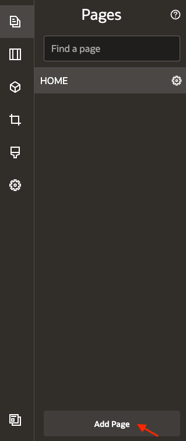
  - Enter the following details while creating a Blog Details page:
  
  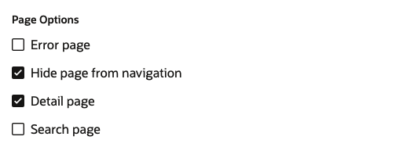
  - Drag and drop *Content PlaceHolder Settings* update the settings as follows: 
    
- Add another component group for displaying the Blogs and add the background *color* #8aadbf.
- We will now add the anchor tag for navigating within the page:
  - Drag and drop *SE-Anchor* from Custom Components into the Component group.
  - Now go to the *Custom settings* and update the Anchor name as *Blogs*.
- Add a *Title*. Click on the title and type "Blogs" and align the text to *Center*. 
- Drag and drop the *Content List* from the left navigation bar into the component group below the Title and update the settings as follows:


  | Property      | Value |
  | ----------- | ----------- |
  | Content Type | SE2-Story |
  | Categories	| CCI>Blogs |
  | Item View | Summary Card View |
  | List View | Three Columns |

  
  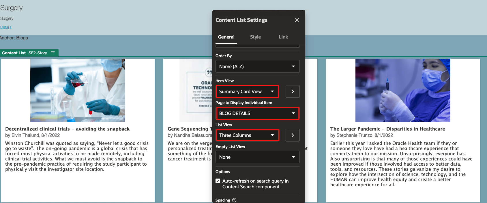

5. Display Content List for *Health Talks*:
- Create a page for Health Talks Details. 
  - Click on the navigation on the top left and select Pages>Add Page. 
  
  - Enter the following details while creating a Health Talk Details page:
  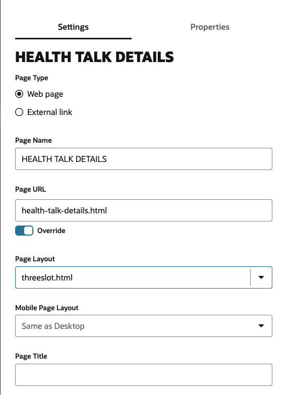
  
  - Drag and drop *Content PlaceHolder Settings* update the settings as follows: 
  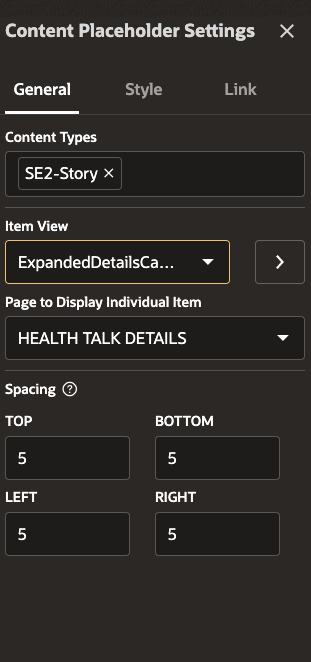  
- Add another component group for displaying the Health Talks and add the background *color* #4b6576.
- We will now add the anchor tag for navigating within the page:
  - Drag and drop *SE-Anchor* from Custom Components into the Component group.
  - Now go to the *Custom settings* and update the Anchor name as *Health Talks*.
- Add a *Title*. Click on the title and type "Health Talks", align the text to *Center*, select the text to change the *color* of the font to *white*. 
- Drag and drop the *Content List* from the left navigation bar into the component group below the Title and update the settings as follows:


  | Property      | Value |
  | ----------- | ----------- |
  | Content Type | SE2-Story |
  | Categories	| CCI>Health Talks |
  | Item View | Summary Card View |
  | List View | Three Columns |
  
  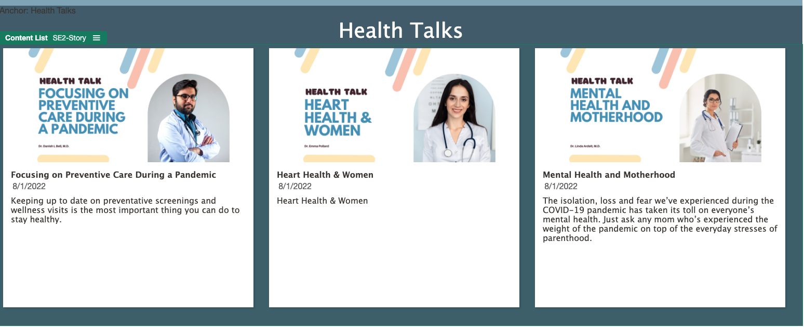
  

6. Display Content List for *Testimonials*:

- Create a page for Testimonial Details. 
  - Click on the navigation on the top left and select Pages>Add Page. 
  
  - Enter the following details while creating a Testimonial page:
  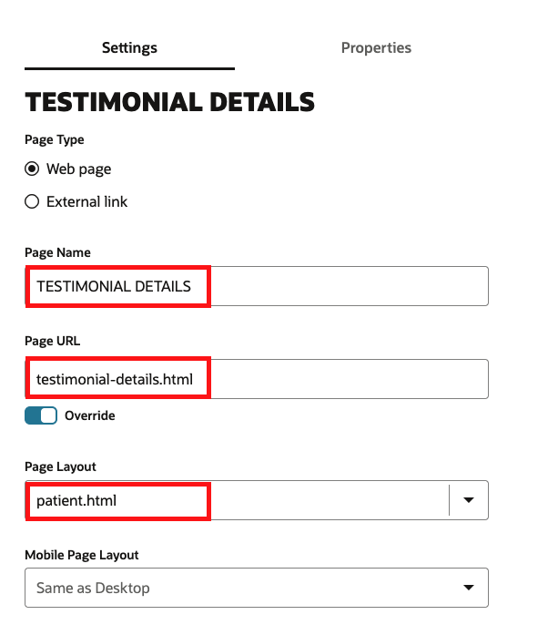
  
  - Drag and drop *Content PlaceHolder Settings* update the settings as follows: 
    
  - Add the "Minimal-Header" component group for the header and "Minimal-Footer" component group for the footer.
 - Add another component group for displaying the Testimonials.
 - We will now add the anchor tag for navigating within the page:
  - Drag and drop *SE-Anchor* from Custom Components into the Component group.
  - Now go to the *Custom settings* and update the Anchor name as *Testimonials*.
 - Add a *Title*. Click on the title and type "Testimonials", align the text to *Center*.
 - Add YouTube video component within the component group and add the link: https://www.youtube.com/watch?v=8hCvvJz-yGs
   
 - Drag and drop the *Content List* from the left navigation bar into the component group below the Title and update the settings as follows:

  | Property      | Value |
  | ----------- | ----------- |
  | Content Type | NewsArticle |
  | Categories	| CCI>Testimonials |
  | Item View | Summary |
  | List View | Verticle |
  | Page to Display Individual Item | TESTIMONIAL DETAILS |

  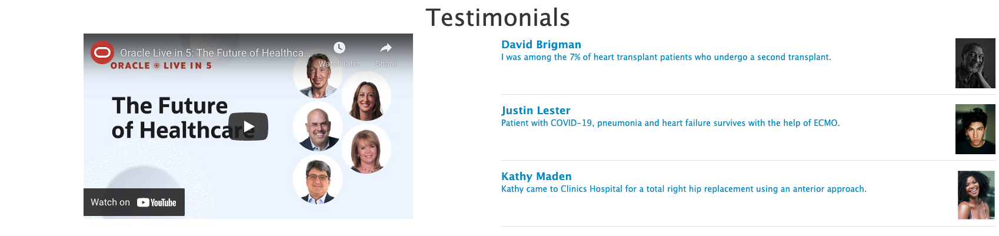

7. Enable Page Navigation: 

- Add the button from Seeded components under the image and update its properties as follows: 
  - General Settings: 
  | Property      | Value |
  | ----------- | ----------- |
  | Width | 10.9375rem |
  | Top | 0.9375rem |
  | Bottom | 5 | 
  | Left | 5 |
  | Right | 5 |

  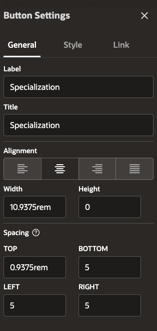

  - Style:
  
  - Trigger Action: 
  

- Copy and paste the style and follow the same steps for Blogs, Health Talks and Testimonials.

*Note:* Make sure to update the Action Triggers in the Link tab.

  

- Go ahead and commit the changes. 

  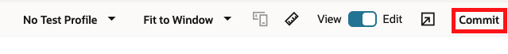

## Task 6: Create a page for the Patient Dashboard

1. In Site Builder, set the switch Edit icon to Edit mode. Enter a name (Ex: PatientDashboard) for the update and click OK.
2. Add a page with the name *PATIENT DASHBOARD*, toggle *Override* under the Page url, select the Page Layout as *Patient.html* and *Save* the changes.
  
2. Drag and drop the *Minimal-Header* component group from the Custom Components section which we created in the previous task in the Header section. 
  
3. Drag and drop the *Minimal-Footer* component group from the Custom Components section which we created in the previous task in the Footer section. 
  

Create a banner: 

- From the left sidebar, drag and drop a Component Group into the Body slot. We’ll create a banner using this component group and the components (which we’ll be adding into it).
- Add the background image to the Component Group(PatientDashboard>patientdashboardbackground.jpg).
 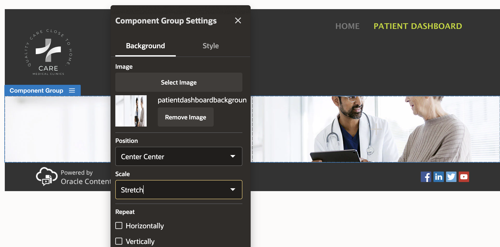

Background Settings: 

  | Property    | Value |
  | ----------- | ----------- |
  | Image | patientdashboardbackground.jpg |
  | Position | Center center |
  | Scale | Stretch | 

- From the section layout, drag and drop *Two Columns* within the Component Group.
 
- Add a spacer from the seeded components into the first coloumn. 
- Place the *title* below the spacer in the first column and update the text as follows: 
"Personalized care when and where you need it..."

  | Property      | Value |
  | ----------- | ----------- |
  | Top | 3vw |
  | Bottom | 1.8vw |
  | Left | 7vw | 
  | Right |	6vw |
- Add a spacer from the seeded components into the first column below the title. 

- *Save* the update.

Create a VBCS Component to view the Patient Visit Details: 

1. Copy the live VBCS web application url which you created in your previous lab.
2. We will now enable VBCS integration in Oracle Content Management.
  - Click the *Integrations* tab under *Administration* section and toggle allow Visual Builder Cloud Service Integration.
  
  - Paste your VBCS url here (https://<<VBCS url>>/ic/builder)
  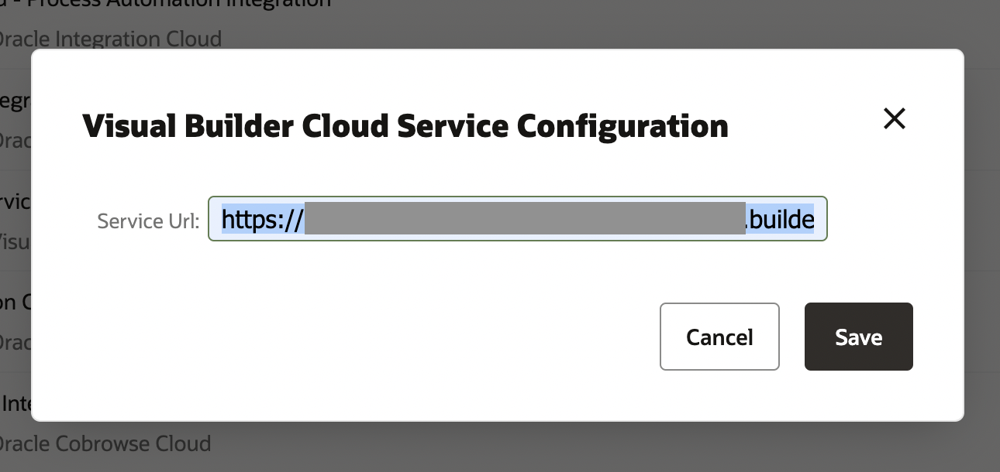
2. Now, Go to the Developer tab in the side bar and select *View all components* under the components section. 
3. Select the Create drop down from the top right of the page and click *Create Visual Builder Component*. 
  
4. Enter the following details in the Dialog box and hit the *Create* button. 
Name: EmbedVBCS, Visual Builder Web Application URL: <<VBCS Live URL>>
 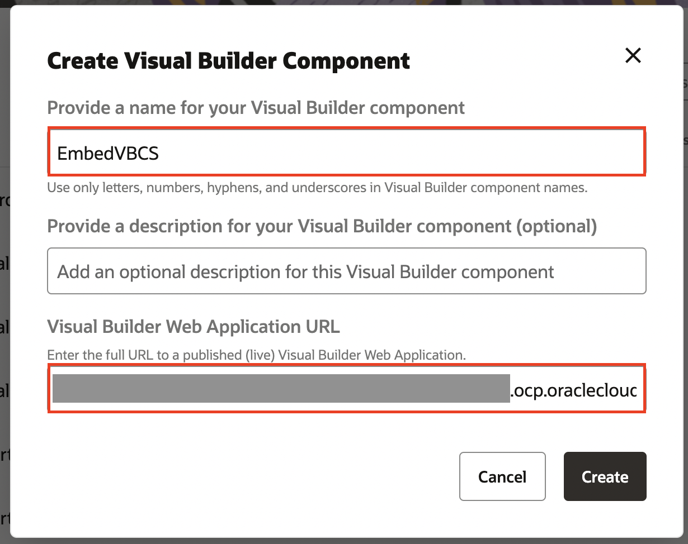
5. After successful creation of the VBCS component, let us add the component to the web page. 
  - Go to the *Patient Dashboard" page and edit the update. 
  - Add the component group below the banner from the Seeded components.
  - Add Two columns from the Section layout into the Component group you just created.
  - Set the width of first column as 75% and second column as 25%.
  
  - Now, add the *title* component in the first column and set the title as *Patient Visit Details*. Set the properties of the title as follows:

  | Property      | Value |
  | ----------- | ----------- |
  | Top | 3vw |
  | Bottom | 1.8vw |
  | Left | 2vw | 
  | Right |	6vw |

  
  - Now, go ahead and embed the *EmbedVBCS* component below the title.
  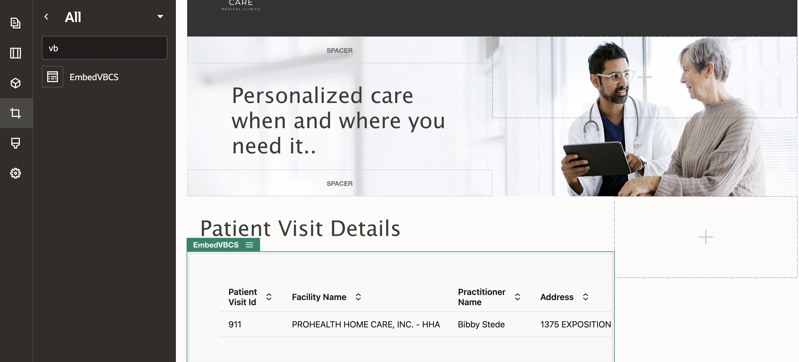

Display Medical Reports:

1. Add the *Title* component from the Seeded components and set the title as *Medical Reports*. 
2. Let us copy the style from the title *Patient Visit Details* and paste the style for *Medical Reports*
 
3. Add the Documents Manager component from the Seeded components under the title which your just added.
4. Select the Lab Reports folder, provide Site Visitor Access: Viewer and disable the upload, move, edit and delete access for the Documents. 
  
 
5. Set the height as follows: 
 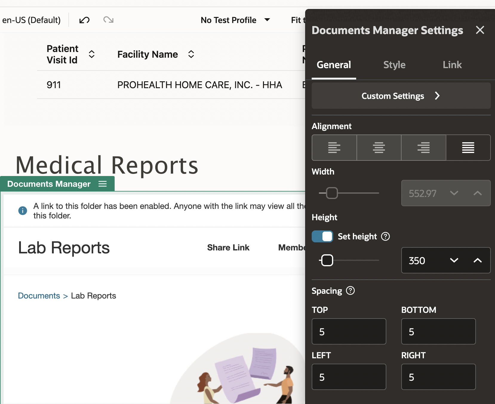

## Task 7: Use Recommendations to display Health Cards

*Recommendations* are a way to provide personalized experiences for website visitors by showing assets based on audience attributes such as location or areas of interest. In this scenario, we want to display the Health cards of the on patient's email id. 

Create Audience Attribute: 

*Audience attributes* are what recommendations use to find and display that personalized content. Here, we will go ahead and create a custom attribute for logged in user.

1. Click *Content* from the Administration section of the side menu.
2. Select *Audience Attributes* from the Content page menu.
3. Click *Custom* to view a list of available custom attributes.
  
4. Click Create.
5. Now, enter the name of the Custom Attribute *patientemail*.
 

Create a Recommendation: 

1. Click Recommendations in the side menu and select the repository to use.
2. Click Create.
3. Enter a name for the recommendation. It cannot contain the following characters: ' ; " : ? < > % *
  | Property      | Value |
  | ----------- | ----------- |
  | Name | ProfileUpdate |
  | API Name | ProfileUpdate |
  | Content Type | Bio |
  | Channels | CareClinicsOCM |

4. Click Create.
  
5. We will now configure the rules. 
  - Drag and drop the *Email* field from the Content Fields to Recommendation rules.
  - Set Email > Equal to > Attribute where 
    - Attribute Category > Custom
    - Custom Attribute > patientemail
  - Click the Done button.
  - Save the recommendation.
  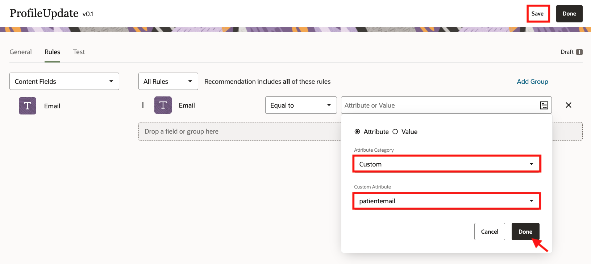

Update the page layout in the theme: 

We will capture the patient's email using 'https://*url*.cec.ocp.oraclecloud.com/system/api/v1/me' and set the audience attribute using *SCSRenderAPI* namespace. 

*Syntax*:

setAudienceAttribute(name, value, optionsopt) → {Boolean}: Sets an audience attribute value given a name and value. Audience attributes set on the URL will take precedence over values set by JavaScript unless options.force equals true.

1. Copy the url of the website <url>.cec.ocp.oraclecloud.com
2. Open the *CareClinicsTemplate* which you synced in your local system in your favorite IDE.

    ```
    <copy>
        <script type="text/javascript">
            var apiUrl = 'https://<url>.cec.ocp.oraclecloud.com/system/api/v1/me';
            fetch(apiUrl).then(response => {
              return response.json();
            }).then(data => {
              // Work with JSON data here
              console.log("Email: "+data.email);
              SCSRenderAPI.setAudienceAttribute("custom.patientemail", data.email);
            }).catch(err => {
              // Do something for an error here
            });
        </script>  
    </copy>
    ```
  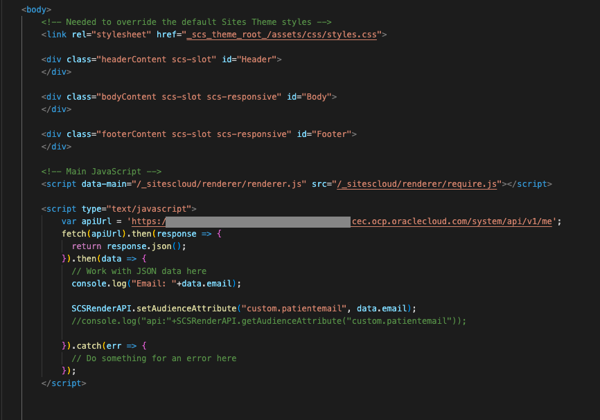


Update the web page: 

1. In the Patient Dashboars, add the *Title* component from the Seeded components and set the title as *Health Cards*. 
2. Let us copy the style from the title *Patient Visit Details* and paste the style for *Health Cards* 
3. Drag and drop the *Recommendation* from the left navigation bar into the component group below the Title and update the settings as follows:

  | Property      | Value |
  | ----------- | ----------- |
  | Recommendation | ProfileUpdate |
  | List View | Vertical |

  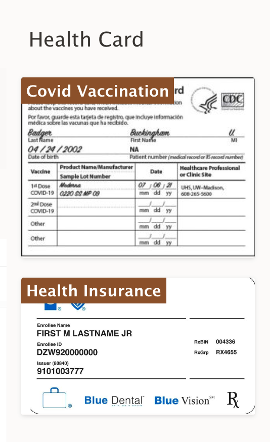
4. After you hit the preview button and refresh the page, you will notice the recommendations personalized for you.

  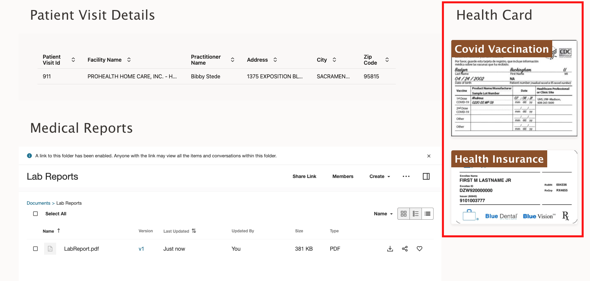

## Task 8: Configure the Care Clinics Chatbot on the Patient's Dashboard page

1. Open your ODA instance and copy ODA URI without https: and Channel ID in the notepad.
  
2. Open the *CareClinicsTemplate* which you synced in your local system in your favorite IDE.
2. Go to the *assets/js* folder and open *settings.js*. 
3. Update the ODA URI and Channel ID as follows:
 
4. Test your chatbot.
 
5. Go ahead and commit the changes. 
 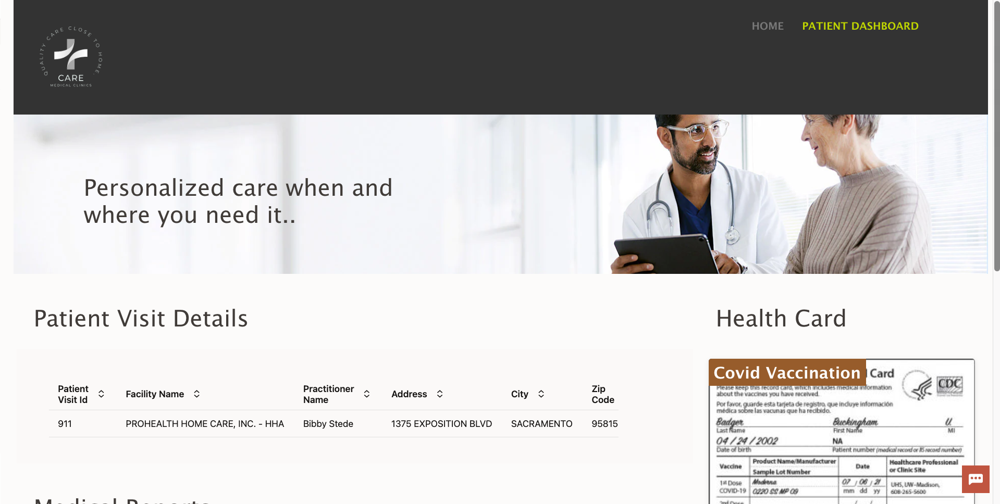

Congratulations you have successfully built a healthcare portal using Oracle Content Management. 

## Task 8: Homework

Add the details page for Specialization.

*Reference*: Go through Task 5 to create a details page for Specializations. 


