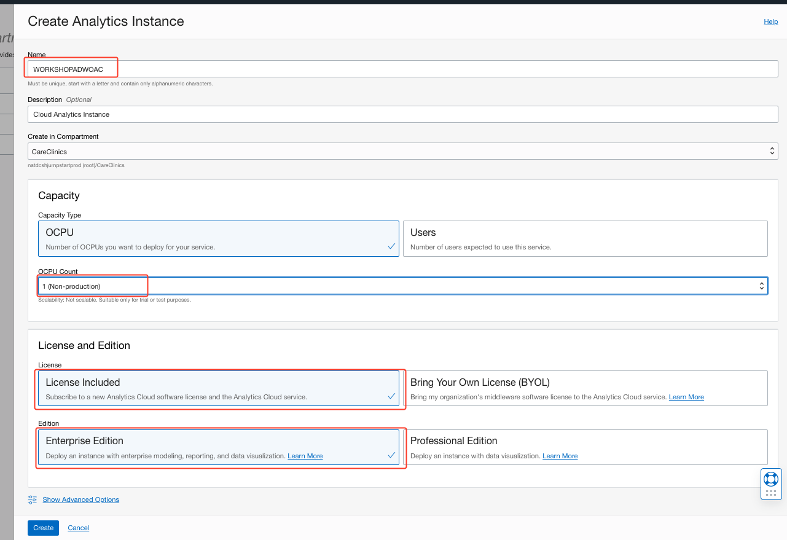
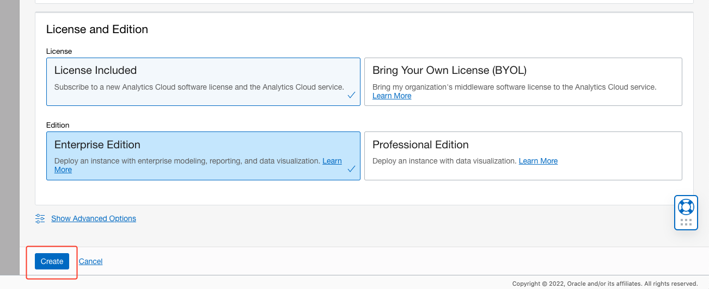

# Hospital Admin Insights from Oracle Analytics Cloud
## Introduction
Up to this point in the course, you have worked with and manipulated all kinds of hospital and patient data. Now, we will perform some data analysis on the patient data gathered into the Autonomous Data Warehouse. In this lab you will learn how to visualization and sharing of data insights through Oracle Analytics Cloud. 

### Objectives

In this lab, you will:
* Create an Oracle Analytics Cloud Instance
* Connect to an Autonomous Data Warehouse data source
* Visualize Hospital Statistics


## Pre-requisites 

* You must have an **IDCS user** set up. If you have completed the "Introduction to OCI" Lab, you already have an IDCS user.


## Task 1: Provision an Oracle Analytics Cloud (OAC) Instance & Enable Auto-Insights

### Introduction

This section describes the process of deploying **Oracle Analytics Cloud** instances on Oracle Cloud Infrastructure Gen 2, which is the default for newly provisioned accounts in **EMEA** and **US**.

Your Oracle Cloud Free Tier account will use the Oracle Cloud Free Trial **credits** when this instance is provisioned, as Oracle Analytics Cloud is not part of the **Always Free** cloud services.

Provisioning an Oracle Analytics Cloud instance can take over **40 minutes**.

Watch our short video that explains how to provision your Oracle Analytics Cloud instance:

[](youtube:ZAqXlhivQCg)

Estimated workshop Time 15 minutes.

### Objectives
- Name and Initiate an Oracle Analytics Cloud Instance
- Enable Auto-Insights under Analytics Settings

0. TO BEGIN: Return to the Oracle Cloud Infrastructure Console accessing from **Oracle Home Page** (oracle.com) and sign in into your cloud account.
Click in **View Account** and **Sign in to Cloud**.

    

1. Click on the menu icon on the left. Verify that you are signed in as a **Single Sign On** (Federated user) user by selecting the **Profile** icon in the top right hand side of your screen. If your username is shown as:

    - oracleidentitycloudservice/&lt;your username&gt;
    
    Then you are **connected** as a **Single Sign On** user.

    

    If your username is shown as:

    -  &lt;your username&gt;
    
    Then you are **signed in** as an **Oracle Cloud Infrastructure** user.

    

    If your user does not contain the identity provider (**oracleidentitycloudprovider**), please logout and select to authenticate
    using **Single Sign On**.

    
    To be capable of using **Oracle Analytics Cloud** we need to Sign-On as a **Single Sign-On** (SSO) user.

    For more information about federated users, see [User Provisioning for Federated Users](https://docs.cloud.oracle.com/en-us/iaas/Content/Identity/Tasks/usingscim.htm).

2. Return to the **Home Console Page** and navigate to **Analytics & AI** section and then **Analytics Cloud**.

    

    > **Note**: You must be connected as a **Single Sign On** (**Federated user**) user to a tenancy, which has available cloud credits to see this menu item. Local OCI users are not able to do this.

3. Select **Create Instance**.

    Complete the form using the following information:

    
    - **Instance Name**: `WORKSHOPADWOAC`
        ```
        <copy>WORKSHOPADWOAC</copy>
        ```
    - **Compartment**: Select a valid compartment in your tenancy

    - **Description**: &lt;Optional&gt;
        ```
        <copy>Analytics Instance for the cloud</copy>
        ```
    - **Feature Set**: Enterprise Analytics (important)
    
    - **Capacity**: 1 - Non Production
    
    - **License Type**: License Included "Subscribe to a new Analytics Cloud software > license and the Analytics Cloud." (You will use this service as part of the free Oracle Cloud trial that you requested for this workshop).

    - **Edition**: Enterprise Edition "Deploy an instance with enterprise modeling, reporting, and data visualization"

        

4. Select **Create**.

    

5. On the **Confirmation** screen, select **Create**.

    The Analytics instance page will be displayed with a status of **CREATING**.

    

    ***Reminder***: Provisioning an Oracle Analytics Cloud instance can take over **40 minutes**.

6. The Analytics instance page will be displayed with a status of **ACTIVE**.

    

7. Activate Auto Insights...


## Task 2: Connect OAC to Autonomous Data Warehouse (ADW)


## Task 3: Create Data Mapping Between ADW Tables in OAC


## Task 4: Create a Workbook in OAC
## Task 5: Explain & Language Narrative Features for quick insights
## Task 6: Table & Map Visualization
## Task 7: Create dashboards for Patients and Labs Analysis
## Task 8: Use Data Actions to Navigate and Filter

## Task Example: Create a Digital Assistant Instance and Import the Skill
1. Log in to the Oracle Cloud at cloud.oracle.com. Cloud Account Name is howarduniversity. Click “Next”.
2. Click on “Direct Sign-In” and enter your Cloud Account email and password.
3. Once you are logged in, you are taken to the cloud services dashboard where you can see all the services available to you. Click the navigation menu in the upper left to show top level navigation choices.
4. Click **Digital Assistant**

  

5. Select the CareClinics compartment and create a Digital Assistant instance. 

  

6. After the instance is successfully created. Click on the Service Console to open the ODA console. 

  

7. Now, select the navigation on the top left menu, select Skills under Development and import the Skill which you downloaded.

  
```
    <copy>
    find a doc
    help from doctor
    how can I find the doctor?
    looking for a doctor
    need doctor assistance
    Where is the doc?
    </copy>
    ```
